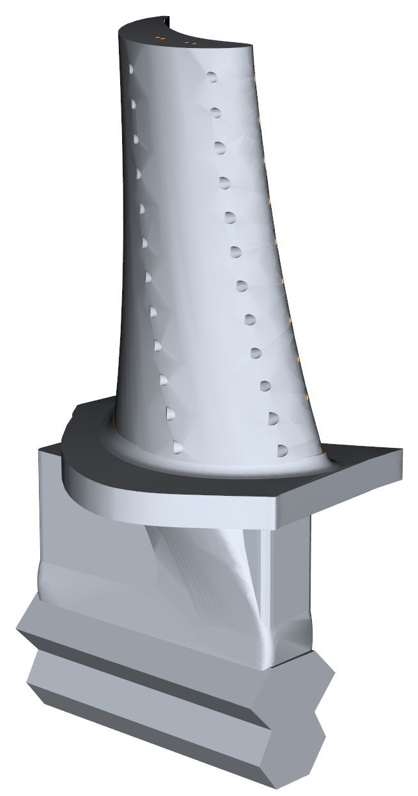
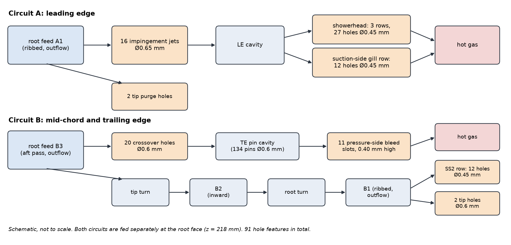
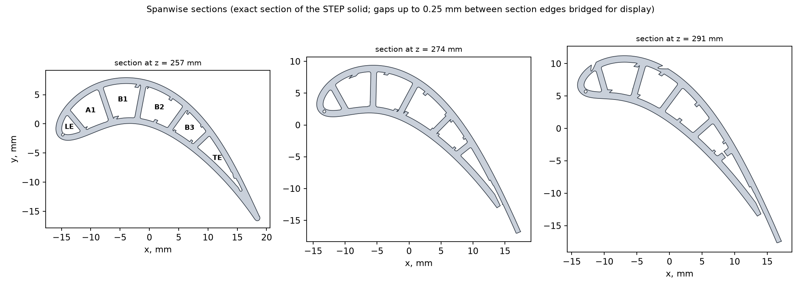
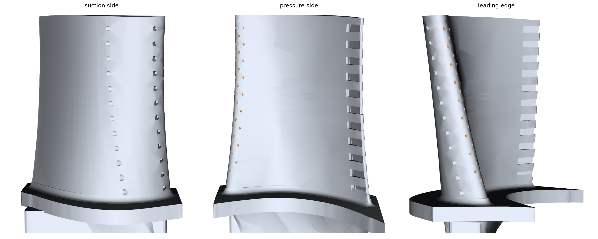

# Cooled HPT Blade: Cooling Architecture and CAD

A high-pressure-turbine (HPT) rotor blade with a two-circuit internal cooling system and film cooling, modelled as a
single CAD solid (66-blade stage, 45 mm span). The repository contains the current CAD model together with its design
basis, the reasoning behind the cooling architecture, and a review of the exported geometry. The project focuses on CAD
design and cooling-architecture development; no CFD, conjugate heat-transfer or structural analysis has been run on the
current CAD model.

## The engineering problem

The first rotor blade of an HPT sits in gas hotter than its nickel single-crystal alloy can tolerate. At the assumed
rotor-inlet condition the blade sees a relative total temperature of about 1,590 K, while the metal has to stay near
1,357 K locally and 1,226 K in bulk to reach a useful creep life. The gap is closed with compressor air routed through
the blade. That air does no work in the blade row and adds mixing loss where it re-enters the gas path, so the design
question is how to hold the metal limits with the least coolant, in a blade that can be cast and drilled.

## Design objective

Develop a turbine-blade CAD model that incorporates a practical cooling architecture: internal cooling to remove heat
from the wall, and film cooling to lower the temperature of the gas that drives heat into it, with coolant fed from the
root and discharged where its pressure suits the local external pressure.

## Cooling architecture

Two internal coolant circuits are fed separately at the root face and exit where their pressure suits them.

* **Circuit A, leading edge.** Root feed A1 supplies 16 impingement jets that strike the inside of the leading-edge
  cavity; the spent air leaves through three rows of showerhead holes and a suction-side film row.
* **Circuit B, mid-chord and trailing edge.** The aft passage B3 feeds the trailing-edge pin cavity, which discharges
  through 11 pressure-side bleed slots. The rest of the flow runs a three-pass ribbed serpentine (B3, B2, B1) and leaves
  through a second suction-side film row and tip holes.

The model contains 91 hole features (16 impingement jets, 20 trailing-edge crossover holes, 27 showerhead holes, 12 + 12
suction-side film holes and 4 tip holes), 70 rib segments, 134 trailing-edge pins and 11 discharge slots.

## Design basis

The geometry was developed from an assumed stage operating point anchored to published GE test-engine data. Values taken
from the published reference are separated from project assumptions in the status column.

| | Value | Status |
|---|---|---|
| Rotor-inlet gas | 1,700 K, 3.0 MPa; nozzle exit 600 m/s at 68° | ASSUMED, anchored to the NASA/GE Energy Efficient Engine HPT (rotor inlet 1,694 K) |
| Blade speed | 350 m/s at 275 mm mean radius (12,154 rpm) | ASSUMED |
| Stage | 66 blades, span 45 mm (252.5–297.5 mm radius), exit swirl −20° | DECISION; reaction 0.20 hub, 0.32 mean |
| Sections | thickness/chord 0.21 hub, 0.19 mean, 0.17 tip; leading-edge radius 1.8 mm | DECISION, sized to fit six cavities |
| Coolant at the root | 879 K, 2.95 MPa; target about 3 % of core flow | CALCULATED from the reference engine's cooling source, with an assumed supply loss |
| Metal limits | 1,357 K local, 1,226 K bulk | ASSUMED, anchored to the reference engine's coating and pitch-line temperatures |
| Walls | 1.0 mm skin, 0.9 mm webs, 0.75 mm trailing-edge lip | DECISION; no manufacturing source (see [limitations](LIMITATIONS.md)) |

Details, sources and the decision list are in [`design/`](design/README.md).

## Why the main features exist

| Feature | Reason |
|---|---|
| Two circuits fed from the root | The showerhead exits at near-stagnation pressure and the trailing edge at the lowest, so each circuit has its own supply (DECISION). The two-circuit design has a showerhead back-flow margin of 0.11 (CALCULATED, 94-hole model); a shared-supply case was not calculated |
| Impingement jets in the leading edge | Highest external heat transfer is at the stagnation region; the jets give the nose its internal cooling |
| Three-pass ribbed serpentine | A two-pass layout with large passages warmed the coolant only 60–80 K; smaller passages and three passes raised the exit temperature to about 970 K at about 3 % flow |
| Trailing edge fed from the first pass | The coolest air goes to the thinnest, hardest-to-cool region, as in the reference engine |
| Pin cavity and 11 bleed slots | The thin trailing edge needs pins for conduction and heat transfer; the slot count follows the reference engine |
| Two suction-side film rows, no pressure-side row | The model put the peak metal temperature on the mid suction side; a pressure-side row over-cooled that surface and starved the serpentine |
| Film holes not smaller than 0.45 mm | The optimiser drove holes to 0.35 mm; the reference design used 0.51 mm and notes that small holes plug |
| Flared shank | Puts the airfoil walls over the shank instead of loading the platform in bending (earlier-geometry screening FEA: hub-band peak von Mises 942 → 593 MPa) |

*Rows that quote model outcomes (coolant warm-up, over-cooling, hole size) come from the project's coupled model on an earlier geometry; those data are not published, and [figure 05](figures/05_design_iterations.png) shows the iteration chart.*

## Current CAD model

*Sections of the exported solid (gaps up to 0.25 mm between section edges are bridged for display). At z = 257 mm the six
passages are labelled; at the higher stations the plane crosses hole and slot cuts, which open some passages to the outside.*

The blade is one valid solid of 1,542 faces and 17,216.6 mm³, with the root face at z = 218 mm and the airfoil tip at
z = 297.5 mm. The cooling design file listed 94 holes; three were removed because their geometry was unsound (two showerhead
holes ended in a dead-end tail and the last trailing-edge crossover hole overlapped the tip turn), leaving the 91 above
([why](design/README.md#from-94-to-91-hole-features)). The CAD files, their identification hashes and the coordinate
system are described in [`cad/`](cad/README.md).

## Geometry review

The exported CAD was examined for what a cooling design needs from its geometry: that every hole cuts through into its
passage, that the 11 trailing-edge slots are open from the pin cavity to the outside, that the six passages and two root
feeds are connected where intended and separate where not, and that the walls keep their thickness. Wall thickness was
sampled on the solid (minimum 0.68 mm at the trailing-edge lip, 0.85 mm in the webs). SolidWorks imports the model as one
body with a volume that agrees with the independent measurement to about 0.01 %. Methods, results and exceptions are in
[`verification/`](verification/README.md).

## Key results

The current CAD model is a single valid blade solid with 1,542 faces and 17,216.6 mm³ volume. All 91 cooling-hole openings and 11 trailing-edge discharge slots were confirmed on the exported geometry, with sampled wall thickness of at least 0.68 mm (based on the exported CAD geometry).
The design allocates 3.15% of core flow to coolant, and the project thermal model predicts a peak metal temperature of 1,317 K, 40 K below the assumed local limit; this is not a CFD result.
Film-cooling effectiveness is the dominant unresolved thermal uncertainty: a 30 % lower effectiveness adds 46 K in the 94-hole model, more than the margin to the metal limit, and should be addressed in subsequent simulation.

## Limitations

* No CFD, conjugate heat-transfer or structural analysis has been run on the current CAD model, and nothing is validated by experiment.
* The wall minimum rests on two patents, not a manufacturing standard. The trailing-edge lip (designed 0.75 mm,
  sampled 0.68 mm) assumes an advanced thin-wall casting process.
* The hole, passage and connectivity reviews compare the exported solid with the intended feature geometry from the design
  data rather than re-deriving it independently; flood-fill connectivity and hole-to-hole interference were not run;
  SolidWorks reports `Check2` = 2, not explained.
* Earlier 2-D RANS and screening FEA exist for earlier geometry only ([`analysis_context/`](analysis_context/README.md)).

Full list: [`LIMITATIONS.md`](LIMITATIONS.md).

## Repository map

| | |
|---|---|
| [`design/`](design/README.md) | operating point, architecture, decisions and why, sensitivities, references |
| [`cad/`](cad/README.md) | the current CAD model (zipped STEP), structural derivative, identification, how to open it |
| [`verification/`](verification/README.md) | geometry review of the exported CAD, with recorded results |
| [`data/`](data/) | design data: section definition, design basis, cooling design |
| [`analysis_context/`](analysis_context/README.md) | 2-D RANS and FEA on earlier geometry; not validation of the current CAD |
| [`history/`](history/README.md) | the initial design and how the design evolved, briefly |
| [`scripts/`](scripts/README.md) | design-basis calculation, panel method and wall-thickness measurement |
| [`EVIDENCE_INDEX.md`](EVIDENCE_INDEX.md) | where each number comes from |
| [`figures/`](figures/README.md) | figures and their sources |

This repository has not undergone independent external review.

Project by **Tanish Shetty**. Tools: Python (NumPy) for design calculations, SolidWorks 2026
(import and volume comparison), ANSYS Fluent 2025 R1 and ANSYS MAPDL 2025 R1 (earlier geometry only). Code is MIT-licensed; CAD and figures
are covered by [`ASSET_NOTICE.md`](ASSET_NOTICE.md).
