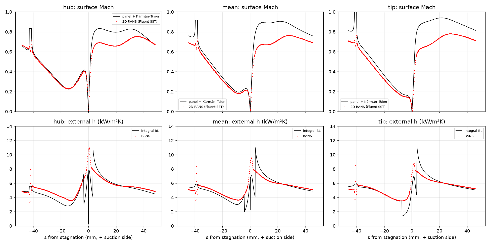
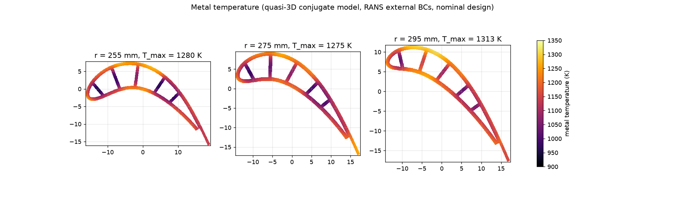
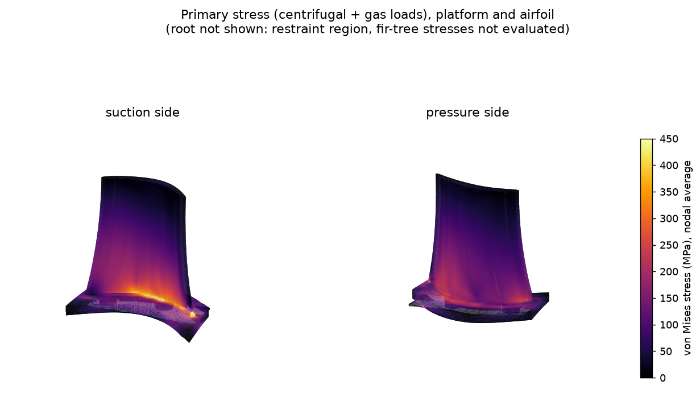

# Analysis context: 2-D RANS and screening FEA on earlier geometry

> **Earlier geometry. Not validation of the current design.**
> Everything in this folder was run on the second-design blade, not on the current design, and the results are not attached to the current design.
> The current-design CAD has had no CFD, conjugate heat-transfer or structural analysis.

These analyses explain where the design inputs came from: the external boundary conditions of the cooling model and the
structural reasoning behind the shank shape. They are included so the design can be traced, not as evidence for the final CAD.

## 2-D blade-to-blade RANS (external flow)

* **Set-up.** ANSYS Fluent 2025 R1, compressible, k-ω SST, ideal gas (γ = 1.3), periodic blade-to-blade domain at hub, mean
  and tip, y⁺ about 1.3 (maximum 2.0), about 41,000 cells per section. Adiabatic-wall temperature from one run, heat-transfer
  coefficient from an isothermal run (h = q / (T_aw − 1,250 K)).
* **Purpose.** Surface pressure and external heat-transfer distributions as boundary conditions for the cooling model, and a
  check of the panel-method loading used to shape the airfoil.
* **Defect found and corrected.** The first runs used the solver's default energy equation, which omitted viscous dissipation,
  pressure work and kinetic energy; the adiabatic wall then recovered only about 30 % of the dynamic temperature. All runs were
  repeated with the full energy equation, after which the adiabatic-wall temperature matched the analytical recovery
  temperature within a few kelvin.

| | exit angle RANS / design | exit Mach RANS / design | loss Y |
|---|---|---|---|
| hub | −60.7° / −61.3° | 0.612 / 0.626 | 0.050 |
| mean | −62.3° / −62.5° | 0.639 / 0.651 | 0.043 |
| tip | −63.6° / −63.7° | 0.666 / 0.678 | 0.039 |

The panel method predicts the exit angle within 0.6° and overpredicts suction-side peak Mach: RANS peaks at 0.75 / 0.76 / 0.78 (hub / mean / tip; maxima of the stored `M_cfd` data), the panel curves in the figure at about 0.83 / 0.91 / 0.94 (read from the plot; the panel values are not stored in this repository). Section-averaged
external h agrees within 2 % on the suction side between RANS and an integral boundary-layer model; RANS is 9–19 % higher on the
pressure side and at the stagnation point (9.5 against 7 kW/m²K for the mean section). The design uses the RANS distributions, the more
conservative of the two. Data: [`rans_2d/`](rans_2d/).

Limits: two-dimensional, no tip gap, endwall or film-hole flow, no conjugate heat transfer, one turbulence model, no mesh study reported.

## Metal temperature (project model)

*Quasi-3D conduction model with the RANS boundary conditions, nominal earlier design. CALCULATED; not CFD. The model's later
values for the 91-hole design are in [`../design/README.md`](../design/README.md).*

## Screening structural FEA

* **Set-up.** ANSYS MAPDL 2025 R1 on a structural derivative of the second design body (passage network only: holes, ribs, pins and
  cut-back removed; their local effect is noted, not computed). Tetrahedral quadratic mesh (SOLID187), 0.6 mm elements in the airfoil
  and platform, about 372,000 nodes. Centrifugal load at 12,154 rpm plus design-point gas loads (771 N tangential, 363 N axial). The set-up values in this paragraph are recorded from the unpublished model files.
  The bottom 2 mm of the simplified root is restrained.
* **Material.** CMSX-4-class single crystal treated as isotropic ⟨001⟩ with temperature-dependent modulus and expansion (ASSUMED).
* **What it showed.** With a box shank the airfoil walls loaded the platform in bending. The flared shank of the second design lowered the
  hub-band stresses; peak von Mises in the r = 252.5–254 mm band fell from 942 to 593 MPa.

| Band (radius, mm) | median von Mises, box shank → flared shank (MPa) | p99 (MPa) | peak (MPa) |
|---|---|---|---|
| 252.5–254 | 202 → 140 | 521 → 402 | 942 → 593 |
| 254–258 | 231 → 188 | 523 → 369 | 626 → 430 |
| 258–265 | 211 → 161 | 364 → 251 | 484 → 274 |

* **Creep.** On a conservative local elastic basis (local von Mises stress at local metal temperature), 0.26 % of the second design airfoil
  surface nodes have a rupture life below 300 h; the shortest, 46 h, is at r = 253.7 mm (1,250 K, 407 MPa). A section creep-rupture
  model with stress redistribution found no section life-limiting (predicted section lives of 4.9 × 10⁵ h and above, in the
  extrapolated range of the rupture curve, against the 300 h screening target). Local creep strain and thermo-mechanical fatigue at the hub mid-chord hot strip remain an open risk, because they need an
  anisotropic creep analysis.
* **Vibration.** First flap frequency of the second design: 1,133 Hz with the root base fixed and 1,560 Hz with the whole root fixed, so its
  position against engine orders depends on the attachment model.

Limits: no fir-tree contact, no fatigue, temperature-dependent moduli assumed, no stress at the root evaluated, holes and ribs
excluded, mesh convergence not shown. Data: [`fea_screening/`](fea_screening/).
