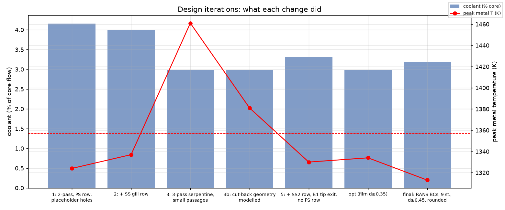

# Design basis and cooling architecture

Labels used throughout (**SIMULATION**: CFD or FEA, earlier geometry only; results marked "model output, not published" come from the project model, whose data are not in this repository): **SOURCED** (taken from a cited public document), **ASSUMED** (a project assumption),
**CALCULATED** (derived by the project's models), **DECISION** (a design choice), **VERIFIED** (measured on the CAD).

## The thermal problem

The first rotor blade of a high-pressure turbine sits in gas hotter than its nickel single-crystal alloy can tolerate.
At the assumed rotor-inlet condition the blade sees a relative total temperature of about 1,590 K, while the metal has
to stay near 1,357 K locally and 1,226 K in bulk to reach a useful creep life. The gap is closed with air taken
from the compressor and routed through the blade. That air is not free: it bypasses the combustor, does no work in
the blade row and adds mixing loss where it re-enters the gas path. The design question is how to hold the metal limits
with the least coolant, in a blade that can be cast and drilled.

Internal cooling (impingement, ribbed passages, pins) removes heat from the wall; film cooling lowers the temperature of
the gas that drives heat into it. Neither is sufficient alone where the external heat load is highest, and the
pressure that drives the coolant out must exceed the local external pressure with margin at every exit.

## Operating point and blade basis

| Quantity | Value | Status |
|---|---|---|
| Rotor-inlet T01, P01 | 1,700 K, 3.0 MPa | ASSUMED; reference engine rotor-inlet design 1,421 °C = 1,694 K, compressor delivery 2.66–3.08 MPa (SOURCED, [G1](REFERENCES.md)) |
| Nozzle exit | 600 m/s at 68° | ASSUMED |
| Blade speed | 350 m/s at the 275 mm mean radius (12,154 rpm) | ASSUMED |
| Annulus | radius 252.5–297.5 mm (span 45 mm) | retained from an earlier project stage |
| Rotor exit swirl | −20° | DECISION: hub reaction about 0.2 (0.196); mean reaction 0.32 (reference engine 0.34) |
| Core flow | 79.9 kg/s, 1.21 kg/s per blade passage | CALCULATED |
| Blades | 66 | DECISION; suction-side diffusion ratio 1.17–1.20 for 66–72 blades, Zweifel about 1.0 |
| Sections | thickness/chord 0.21 / 0.19 / 0.17 (hub / mean / tip), leading-edge radius 1.8 mm | DECISION, the smallest values that hold six cavities with 1.0 mm walls and 0.9 mm webs |
| Chord | 38.9 / 38.6 / 41.5 mm | CALCULATED from the section definition ([`../data/blade_sections.json`](../data/blade_sections.json)) |
| Stacking lean | 1.06 mm axial, 2.22 mm tangential at the tip | CALCULATED; cancels design-point gas bending (hub bending stress 102 → about 0 MPa) |
| Coolant at the root | 879 K, 2.95 MPa | CALCULATED from the reference engine's cooling-air source (593 °C), an assumed inducer radius of 0.15 m and a 5 % supply loss |
| Coolant target | about 3 % of core flow | ASSUMED, within the reference blade's 2.25–3.3 % |
| Metal limits | 1,357 K local, 1,226 K bulk | ANCHORED to the reference blade's coating maximum (1,084 °C) and pitch-line bulk temperature (953 °C) |
| Alloy | CMSX-4-class single crystal, ⟨001⟩ radial | DECISION; properties ASSUMED |

Velocity triangles (free vortex, constant axial velocity 225 m/s):

| | exit angle β3 | turning | ψ = Δh/U² | reaction | M3,rel |
|---|---|---|---|---|---|
| hub | −61.3° | 113.0° | 2.16 | 0.20 | 0.63 |
| mean | −62.5° | 105.1° | 1.82 | 0.32 | 0.65 |
| tip | −63.7° | 94.8° | 1.56 | 0.42 | 0.68 |

The stage is more highly loaded than the reference engine (tip speed 379 m/s against 514 m/s), which is ASSUMED to lie
within high-work HPT practice; centrifugal stresses are correspondingly lower than an engine-scale rotor would see.

## Cooling architecture

Two circuits are fed separately at the root face (z = 218 mm). Each exits where its pressure suits it.

| Family | Count | Diameter / size | Fed by | Role |
|---|---|---|---|---|
| Leading-edge impingement jets | 16 | 0.65 mm | A1 | strike the inside of the leading-edge cavity (s/d = 4) |
| Showerhead | 27 (3 rows) | 0.45 mm, 30° radial | LE cavity | film over the stagnation region |
| Suction-side gill row | 12 | 0.45 mm, shaped, at 6.0 mm from stagnation | LE cavity | film on the accelerating suction side |
| Suction-side second row (SS2) | 12 | 0.45 mm, shaped, at 28 % camber | B1 | film where the model put the peak temperature |
| Trailing-edge crossover | 20 | 0.6 mm | B3 | feed the pin cavity |
| Tip holes | 4 | 2 × 0.45 mm (A1), 2 × 0.6 mm (B1) | A1, B1 | keep dead-ended passages flowing near the tip |
| **Hole features** | **91** | | | |
| Pressure-side bleed slots | 11 | 0.40 mm high, 1.78 mm open, 2.13 mm lands, cut-back at 88 % chord | pin cavity | trailing-edge exit |
| Trailing-edge pins | 134 | 0.6 mm, 1.4 mm pitch | | conduction and heat transfer in the thin trailing edge |
| Ribs | 70 segments | height 0.10 of the hydraulic diameter, pitch 10 × height | A1, B1, B2, B3 | raise internal heat transfer |

Walls are 1.0 mm, webs 0.9 mm, core fillets 0.25 mm and the trailing-edge suction-side lip 0.75 mm (DECISION).

* **Circuit A** (15.9 g/s, 94-hole design): A1 → 16 jets → leading-edge cavity → showerhead and gill row; two tip purge holes.
* **Circuit B** (22.7 g/s, 94-hole design): B3 → crossover holes → pin cavity → 11 bleed slots; B3 → tip turn → B2 → root turn →
  B1 → SS2 row and two tip holes.

*How the architecture came out of the model (CALCULATED, earlier-geometry model): each change and what it did to coolant
fraction and peak metal temperature.*

| Iteration | Change | Coolant | Peak metal | Lesson |
|---|---|---|---|---|
| 1 | two-pass serpentine, pressure-side row, placeholder holes | 4.16 % | 1,324 K | over-cooled; coolant heated only 60–80 K |
| 2 | + suction-side gill row | 4.00 % | 1,337 K | more exit area raised circuit-A flow, not cooling |
| 3 | three-pass serpentine, smaller passages | 2.99 % | 1,461 K | coolant used well; the trailing-edge hot spot was a modelling error |
| 3b | pressure-side cut-back modelled geometrically | 2.99 % | 1,381 K | hot band on the mid suction side over B1 |
| 5 | + SS2 row, B1 tip exit, no pressure-side row | 3.31 % | 1,330 K | pressure side needed no film |
| opt | 15-variable constrained optimisation | 2.98 % | 1,334 K | optimiser pushed holes to 0.35 mm |
| final | external boundary conditions from RANS, holes ≥ 0.45 mm, rounded | 3.19 % | 1,312 K | the chart shows the 1,313 K of the run before the last rounding |

## Coupled model results (CALCULATED, not CFD on this geometry)

The model is a 2-D finite-volume conduction solution in the real metal section at nine radii, coupled to a 1-D coolant
network per circuit (supply pressure, inlet loss, rotation, rib friction, turns, orifices to the local static pressure)
and to a film-effectiveness correlation. External boundary conditions come from 2-D RANS at hub, mean and tip on the
earlier geometry ([`analysis_context/`](../analysis_context/README.md)).

| | Designed, 94 hole features | project model, 91 hole features (as modelled in the current CAD) |
|---|---|---|
| Coolant per blade | 38.6 g/s = 3.19 % of core flow | 38.1 g/s = 3.15 % |
| Peak metal temperature | 1,312 K (suction side near the tip) | 1,317 K |
| Mean section bulk temperature | 1,147 K | 1,151 K |
| Minimum showerhead back-flow margin | 0.112 | not recomputed |

Uncertainty (94-hole model; peak metal temperature, nominal 1,312 K):

| Perturbation | Change |
|---|---|
| film effectiveness −30 % | +46 K |
| cut-back effectiveness 0.7 → 0.5 | +47 K |
| internal heat transfer −20 % | +6 K |
| metal conductivity −15 % / +15 % | +3 / −2 K |
| leading-edge impingement −30 % | −1 K |

The nominal design holds 45 K margin to the local limit; either film uncertainty alone exceeds it (film −30 % gives 1,358 K against the 1,357 K limit). Film behaviour is
therefore the first thing a simulation of the current design should resolve. Raw numbers: [`sensitivity/`](sensitivity/).

## From 94 to 91 hole features

The original design file listed 94 holes. A geometric review of the hole geometry against the cavities found three that were not sound; they were removed from the CAD before the current model was finalised:

| Removed | Geometry problem | Evidence |
|---|---|---|
| showerhead holes #0 and #19 | the 30° radial inclination put the hole's inner end about 3.4 mm hub-ward of the exit, below the leading-edge cavity floor, leaving a 0.8 mm dead-end tail | position of the hole's inner end against the cavity floor |
| trailing-edge crossover #20 | the last station (z = 295 mm) lies inside the tip turn and overlapped it | position of the last station against the tip turn |

Thermal effect, bounded by the model with a smeared hole density: removing the two showerhead holes gives +5.5 K peak
metal temperature and −0.3 g/s coolant; removing the crossover hole gives 0 K and −0.2 g/s (together +5.5 K and −0.5 g/s). This is an analysis
assumption and has not been checked by simulation of the current design.

## Assumptions that carry manufacturing risk

1. The 0.75 mm trailing-edge lip and the 0.40 mm slot need an advanced thin-wall casting process or core-wall control;
   a thicker lip was rejected because it thins the pressure-side wall over the slot (lip thickness 0.75 / 0.80 / 0.85 mm
   changes peak metal temperature by about 0.5 K, [`sensitivity/`](sensitivity/)).
2. Skin and web walls of 0.85–1.0 mm are within what conventional casting is described to reach (above about 0.76 mm,
   US 6,255,000); the thinner values are not.
3. 0.45 mm holes are drilled or EDM-formed after casting.
4. No manufacturer capability, tolerance or yield has been established.

## Files

* [`decisions.md`](decisions.md): the main design decisions and the reason for each.
* [`REFERENCES.md`](REFERENCES.md): sources.
* [`sensitivity/`](sensitivity/): hole-removal, lip-thickness and film/internal-heat-transfer sensitivities.
* [`../data/`](../data/): the design data behind the CAD: `blade_sections.json` (section definition), `design_basis.json` (operating point, velocity triangles, limits) and `cooling_design.json` (passages, hole rows, ribs, pins and slots).
