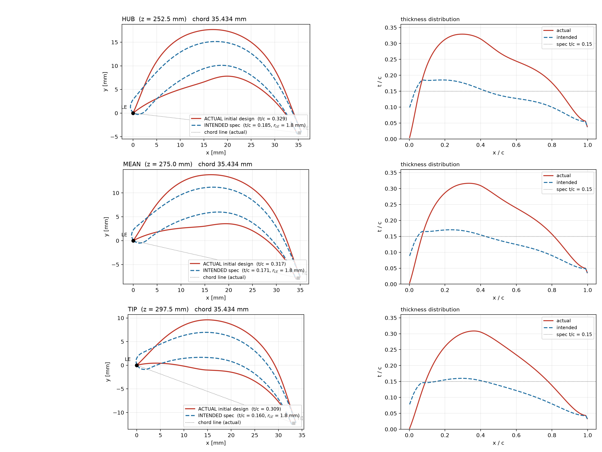
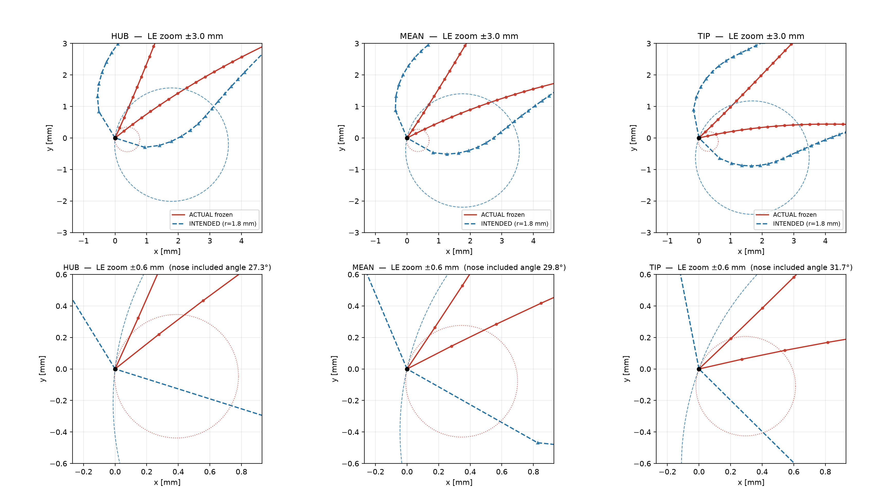
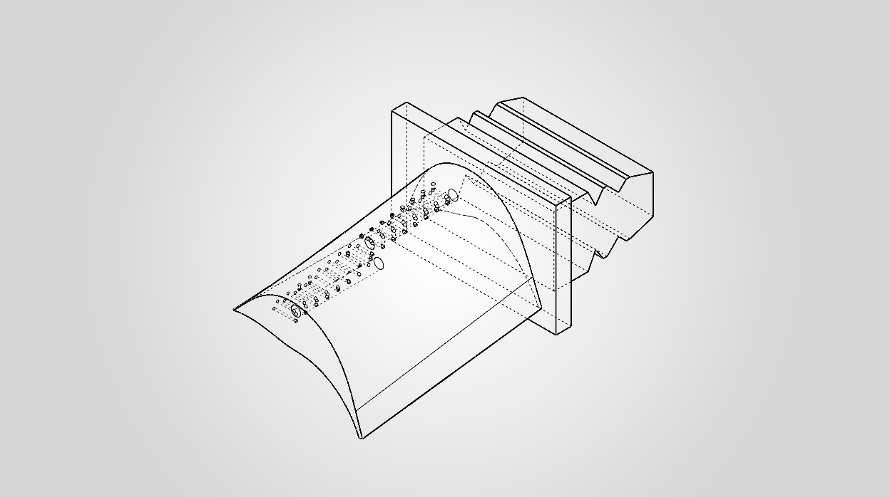

# Initial design: the earlier blade

**Status: superseded, kept as history. Nothing from the initial design's geometry is used in the current design.**

## What it was

A SolidWorks part: an earlier blade shape with a platform and fir-tree root, plus two straight
manifold bores and 32 L-shaped passage legs branching from them (231 features, of which 65 are cut features; volume
29,653.63 mm³; SolidWorks `Check2` = 0; SHA-256 `676f2dc9…dd27702d`).

* [`GE_HPT_Blade_initial_design.SLDPRT`](GE_HPT_Blade_initial_design.SLDPRT)

## What was reported at the time (HISTORICAL)

An earlier version of this repository reported, from checks on that solid: 32 of 32 passages connected (by a
volume-deficit method), 2 manifold segments connected, minimum wall 1.750 mm against a 1.5 mm requirement, smallest
neighbouring-hole ligament 0.413 mm, and the same results after a save, close and reopen. Those are measurements of
the solid and they stand as such. They do not describe a cooling system.

## Why it was superseded

1. **The outer shape was wrong.** Measured thickness/chord (perpendicular to the chord) was 0.329, 0.317 and 0.309 at hub,
   mean and tip, against 0.185, 0.171 and 0.160 for the same camber line built as specified, which is 1.8 to 1.9 times as thick. The specified
   thickness law is 0.15; the larger intended values are the same law measured across the cambered shape. The leading edge was a wedge
   with a nose angle of 27–32° instead of a 1.8 mm radius.

   

   *Actual (red) against the specified shape (blue) at hub, mean and tip; right: thickness distributions.*

   

   Root cause, found by recomputing the section from its own definition: the thickness law returned the maximum thickness
   where a half thickness was expected, which doubles the thickness law exactly (0.30 against 0.15), and the leading-edge radius entered as the
   initial slope of a cubic, which cannot represent the square-root nose.
2. **The passages formed no circuit.** The two bores and 32 legs all ended blind in the metal: no root inlet, no exit,
   no leading-edge cavity, no film hole. No coolant could flow through the network as modelled.
3. **Some published statements were wrong and were corrected.** A "measured leading-edge radius of 0.39 → 0.31 mm" was an
   artefact of the circle-fit window, not a geometric radius; "the leading edge is 3–4 times more thermally severe" rested
   on the same defect; the minimum wall 1.775 mm was a 2-D section value and the solid measures 1.750 mm.

*Hidden-line view of the initial design's passage network. Historical geometry; not the current design.*

## What it taught

Verify the shape a cooling layout sits in before building the layout, and define the flow circuit (inlet, passages,
exits) before counting passages. Both shaped the redesign described in [`../README.md`](../README.md).
